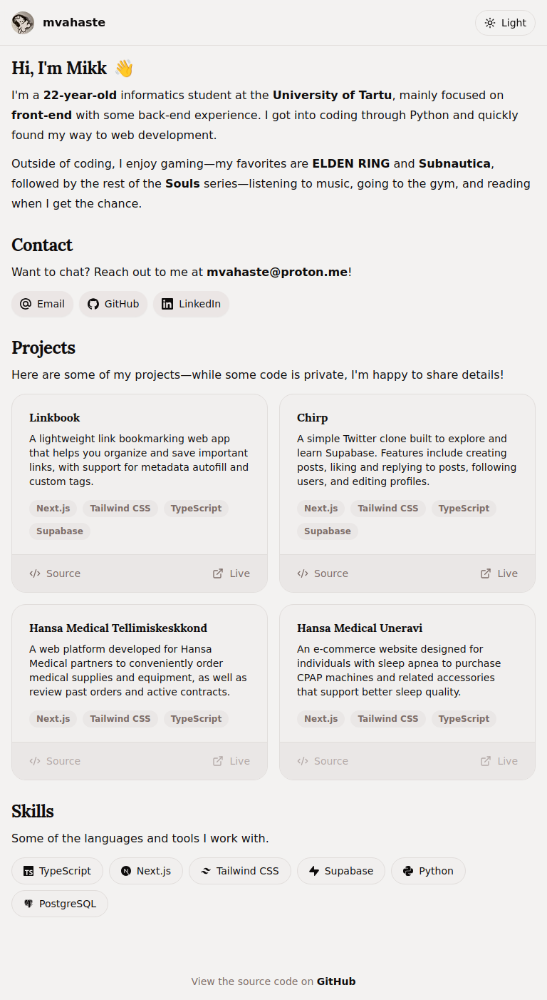
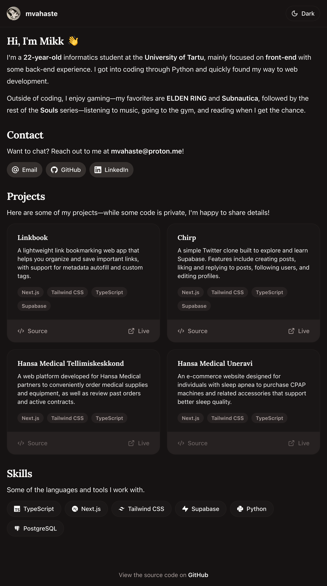

# ☕ mvahaste.dev

This is my personal website, hosted at [mvahaste.dev](https://mvahaste.dev). It's designed with a clean, responsive layout and features simple animations for a bit of character.

## 🔖 Table of Contents

- [✨ Features](#-features)
- [🧰 Technologies](#-technologies)
- [⚙️ Installation](#%EF%B8%8F-installation)
- [🤖 GitHub Actions](#-github-actions)
  - [🔄 Automatic Favicon and Header Image Updates](#-automatic-favicon-and-header-image-updates)
  - [🔄 Automatic Screenshot Updates](#-automatic-screenshot-updates)
- [💻 Screenshots](#-screenshots)
- [📜 License](#-license)

## ✨ Features

- **Responsive Layout** - The website adapts to different screen sizes.
- **Clean Design** - Simple, elegant design with a cream/coffee pastel color theme. ☕
- **Animations** - Staggered fade and slide-in animations on page load, as well as a wave. 👋
- **Dark/Light Mode** - A pleasant color scheme with light and dark mode options.
- **Contact Form** - Reach out through the contact form.
- **Automatic Favicon Updates** - Website favicon updated automatically alongside my GitHub avatar.
- **Automatic Screenshot Updates** - README screenshots updated automatically on successful deployment.

## 🧰 Technologies

- [Next.js 15](https://nextjs.org/) - Framework for building the site
- [TailwindCSS](https://tailwindcss.com/) - Styling framework
- [shadcn/ui](https://ui.shadcn.com/) - Base components for the UI
- [Motion](https://motion.dev/) - Library for animations
- [next-mdx-remote](https://github.com/hashicorp/next-mdx-remote) - Render page content from `.md` files
- [form-to-email](https://www.form-to-email.com/) - To send emails via the contact form
- [Vercel](https://vercel.com/) - Hosting platform
- [GitHub Actions](https://github.com/features/actions) - Automate favicon, header image, and screenshot updates

## ⚙️ Installation

You probably don't need to do this — but just in case, here's how to run the project locally:

1. Clone the repository:
   ```bash
   git clone https://github.com/mvahaste/www.git
   ```
2. Navigate into the project folder:
   ```bash
   cd www
   ```
3. Install dependencies (using `--legacy-peer-deps` due to React 19):
   ```bash
   npm install --legacy-peer-deps
   ```
4. Set up environment variables:
   Create a `.env` file in the root directory and add your `FORM_ENDPOINT`:

   ```env
   FORM_ENDPOINT=<form-to-email endpoint>
   ```

5. Start the development server:

   ```bash
   npm run dev
   ```

6. For production:
   - Build the project:
     ```bash
     npm run build
     ```
   - Run the production server:
     ```bash
     npm run start
     ```

## 🤖 GitHub Actions

### 🔄 Automatic Favicon and Header Image Updates

This repository includes a GitHub Actions workflow that keeps the site's favicon and header image in sync with my GitHub avatar.

#### 🛠️ How It Works

1. **Runs hourly** via a scheduled cron job (`0 * * * *`) or can be triggered manually.
2. Retrieves the latest avatar from my GitHub profile.
3. Compares the fetched avatar with a stored hash to detect changes.
4. If a change is detected, it updates the following files:
   - `.avatar_hash` – stores the hash of the current avatar.
   - `app/favicon.ico` – used as the site’s favicon.
   - `public/images/avatar.png` – used as the header image.
5. Automatically commits and pushes the updated files.

> The GitHub username is sourced from a default environment variable — no hardcoding involved.

#### 🗃️ Relevant Files

- **Workflow**: `.github/workflows/update-favicon.yml`
- **Script**: `scripts/check_avatar.py`
- **Cache File**: `.avatar_hash`

This ensures the site's visuals remain current with my GitHub profile.

### 🔄 Automatic Screenshot Updates

This repository also includes a GitHub Actions workflow that updates website screenshots in the README after each successful Vercel deployment.

#### 🛠️ How It Works

1. **Triggered on every successful deployment** to Vercel or can be run manually.
2. Uses `puppeteer` to capture screenshots of the site in both light and dark modes.
3. Saves the screenshots as:
   - `screenshot-light.png`
   - `screenshot-dark.png`
4. If any changes are detected, the updated screenshots are committed and pushed automatically.

To prevent an infinite loop of deployments and commits, a custom script checks for meaningful changes in the application before proceeding with a build. It ignores files and directories that don't impact the deployed app.

> The repository name, API URL, and access token are all pulled from default environment variables — no hardcoding.

#### 🗃️ Relevant Files

- **Workflow**: `.github/workflows/update-screenshots.yml`
- **Scripts**:
  - `scripts/update_screenshots.js`
  - `scripts/build_check.sh`

This ensures the README always reflects the latest visual state of the website.

## 💻 Screenshots

This is how the website looks in both light and dark modes.

| Light Mode                                     | Dark Mode                                    |
| ---------------------------------------------- | -------------------------------------------- |
|  |  |

## 📜 License

This project is licensed under the MIT License.
